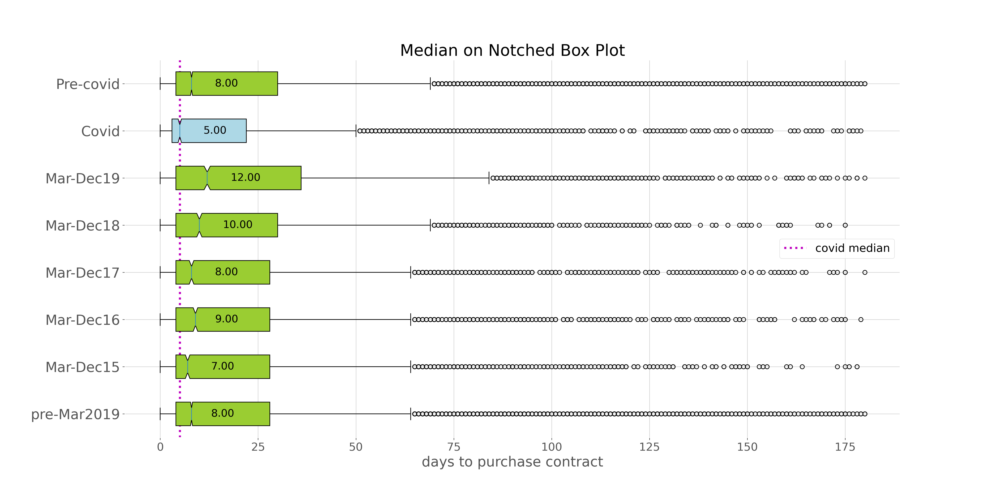
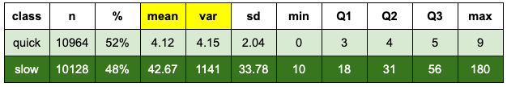
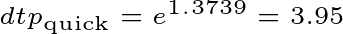
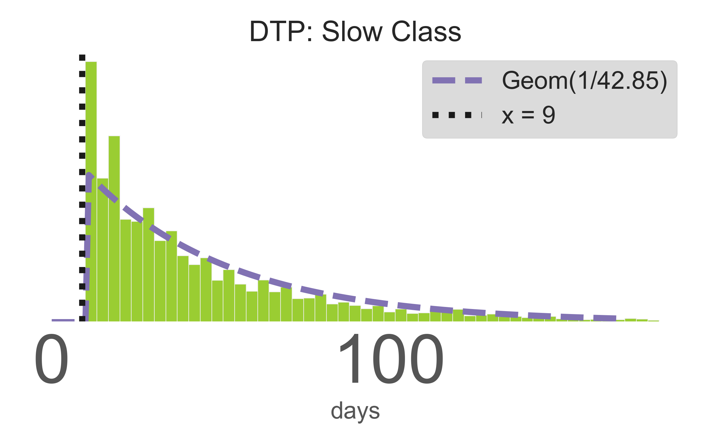
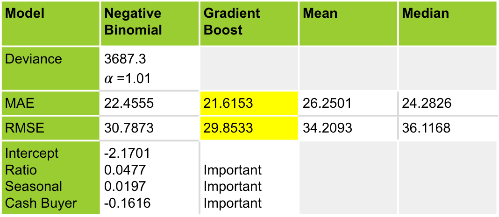
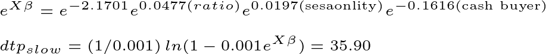
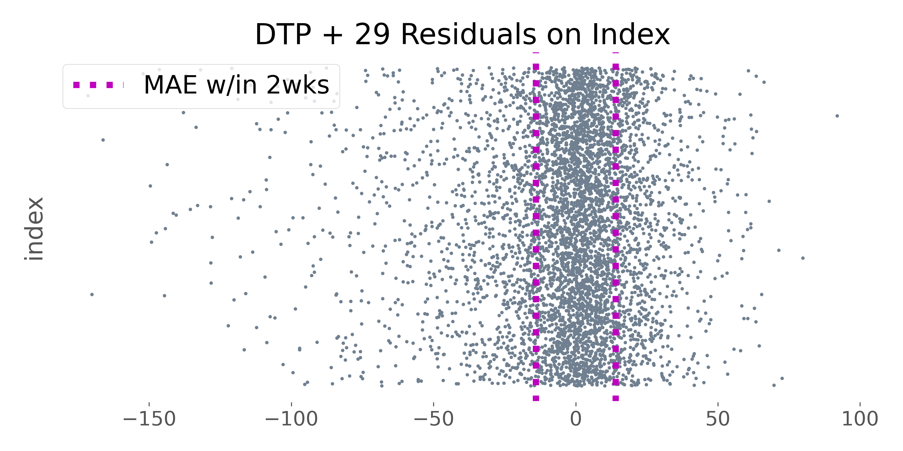

# Days on Market
___


  

___

[Introduction](#Introduction)    
[Roadmap](#Roadmap)    
[Data](#Data) 
- [Randomness & Independence](#Randomness-&-Independence)
- [Complete List of Attributes](#Complete-List-of-Attributes)
- [Color Coding & Abbreviations](#Color-Coding-&-Abbreviations)
- [Auxilary Data](#Auxilary-Data)  

[Cleaning](#Cleaning)    
- [Datetime Conversions](#Datetime-Conversions)
- [Null Values](#Null-Values)
- [Errors](#Errors)  

[Data Loss](#Data-Loss)    

[EDA Targets](#EDA-Targets)
- [Target variables descriptive statisitics](#Target-variables-descriptive-statistics)
  - [Monthly averages for target variables](#Monthly-averages-for-target-variables)
    - [Trend in DTC](#Trend-in-DTC)
    - [Difference in DTP Covid19 Data](#Difference-in-DTP-Covid19-Data)
      - [Subset Descriptive Statistics](#Subset-Descriptive-Statistics)
      - [Hypothesis testing for differences](#Hypothesis-testing-for-differences)
      - [Supply & Demand Context for Covid Data](#Supply-&-Demand-Context-for-Covid-Data)
      - [Insight from Broker Remarks](#Insight-from-Broker-Remarks)  
    - [Seasonality in DTP](#Seasonality-in-DTP)

[EDA Features](#EDA-Features)
- [Feature Engineering](#Feature-Engineering)
  - [Seasonality Feature in DTP](#Seasonality-Feature-in-DTP)
  - [Cash Buyer Strongly Associated with DTC](#Cash-Buyer-Strongly-Associated-with-DTC)
  - [Ratio Feature Strongly Associated with DTP](#Ratio-Feature-Strongly-Associated-with-DTP)
- [Feature Analysis](#Feature-Analysis)
  - [Target Correlation with Price](#Target-Correlation-with-Price)
  - [Price Correlation with Ratio](#Price-Correlation-with-Ratio)

[Model Information](#Model-Information)
- [Generalized Linear Models](#Generalized-Linear-Models)
- [Non parametric Model Gradient Boost](#Non-parametric-Model-Gradient-Boost)
- [Roadmap Reminder](#Roadmap-Reminder)  

[DTC Model](#DTC-Model)    

[DTP Quick, Slow, & Classification Models](#DTP-Quick,-Slow,-&-Classification-Models)    
  - [Maximum Likelihood Estimation](#Maximum-Likelihood-Estimation)
  - [QUICK MODEL](#QUICK-MODEL)
  - [SLOW MODEL](#SLOW-MODEL)
  - [CLASSIFICATION](#CLASSIFICATION)
- [Additive Model & Holdout Results](#Additive-Model-&-Holdout-Results)  
    
[DOM Holdout Results](#DOM-Holdout-Results)  

[DTP Validation Results](#DTP-Validation-Results)     

[DTP+29 Holdout Results](#DTP+29-Holdout-Results)   

[Residual Comparison](#Residual-Comparison)
  
[Conclusions](#Conclusions)  
  - [DTC](#DTC)  
  - [DTP](#DTP)
  - [Most Interesting Insight](#Most-Interesting-Insight)  
  
[Future Work](#Future-Work)   

[Gratitude](#Gratitude) 

[Sources + References](#Sources-+-References)  
- [Text Sources](#Text-Sources)
- [Online Sources](#Online-Sources)
- [Mentor Sources](#Mentor-Sources)

[Tech Stack](#Tech-Stack)

[Appendix](#Appendix)  


___

## Introduction  
The number of days it takes to sell a home is an important metric in real estate.  

- For sellers this determines holding cost.  

- For buyers this is how quickly and competitively to bring and offer.   

- For real estate agents, understanding how long it takes to sell a home allows for income projections, and budgeting for support staff, marketing and vendor orders, not to mention better serving clients.


In an **explanatory context**, we would like to know what factors are strongly related to the days on market metric. 
<br>
In a **predictive context**, we would like to be able to apply a model to new data in order to estimate how quickly a home will sell.


___

## Roadmap      

The time it takes to sell a home is broken up into two distinct pieces. We define the starting point of this process as the listing date, the day the home goes on the market. The ending point is defined as the closing date, the day the sale is legally finalized. The time between listing and closing is composed of two distinct processes separated by the purchase contract date. We model these processes separately, their sum is the days on market (DOM) value.

      

Further, we classify the listing-to-contract model into a quick and slow class, from which we build quick and slow regression models. The listing-to-contract portion of the final model is the average of the results from the quick and slow models weighted by the probabilities of being in the quick and slow class, as determined by the classification probabilities.


Note: We are building multiple models and combining the predictions to achieve a final prediction for the days on market value. A careful strategy for training, validation and holdout sets is necessary. Five fold cross validation on a training set is used to test and choose all preliminary models. A separate holdout set is reserved for testing the chosen models.
___

## Data  


    

The original dataset consists of 34,519 sold single family residences (SFR), contracted for in the city and county of Denver from 2015-2020. Note that *Listing Contract Dates* may predate 2015 and *Closing Dates* may postdate 2020. The [specific query and API information](#Data-Query-+-API-Information) are provided in the appendix.

  

REColorado is the dominant multiple listing service for real estate agents in Colorado. All homes in this dataset are homes listed by real estate agents. A note on population versus sample: This dataset is an REColorado subpopulation of all closed properties contracted for during this time period. Using it as a sample for inference on the entire Denver area market violates an assumption of random sampling.

New Construction and/or Builder types are often under contract prior and during construction. This data should be modeled separately and is not included in this dataset. 

Homes required to participate in a homeowner’s association were excluded from the dataset to help exclude non-single family residences, sometimes mislabeled for reach. This exclusion means that these results are not pertinent to single family homes in planned communities with homeowner’s associations.  
 
From 401 available features, 81 are sufficiently populated, defined as at least 90% non-null values,  41 were useful in identifying errors, exploratory data analysis, or feature engineering. Zero raw attributes had any practical effect in the model. Three engineered features were both statistically significant and practically meaningful. 
 
 
### Randomness & Independence

- This data was queried from REColorado, which makes the data a subpopulation rather than a random sample.  

- There may be spatial dependence between observations. 

The markers indicate the average DTP value per zip code. It looks like on average DTP may be less on the West side of Denver.

  

There is not an obvious spatial dependency indicated in this graphic. 

  

We proceed with the assumption of independent observations, and add spatially dependent modeling techniques to future work.  

### Complete List of Attributes 

The following lists encompass all the attributes that were considered in extracting meaning from this data.

```python
identity = ['Listing Id']

numeric = ['dtp', 'dtc', 'dom', 'ratio', 'fin_sqft',
           'inventory', 'good_agent', 'n_baths', 'n_beds', 
           'n_fireplaces','n_photos', 'orig_price', 
           'close_price', 'lot_sqft','walkscore', 
           'psf', 'em', 'ba_comp', 'garage_spaces', 
           'year_built']

boolean = ['quick', 'back_on_market', 'is_vacant', 
           'has_fireplace', 'has_bsmt', 'one_story', 
           'is_realtor', 'offer_var_comp', 'has_virtual_tour', 
           'has_showing_instr', 'with_cash','is_corp_owner', 
           'is_warm']

categoric = ['financing', 'ownership', 'garage_size', 
             'period', 'photo'] 
             
binned = ['garage_zero', 'garage_one', 'garage_two',
          'period_turn', 'period_midmod', 'period_modern', 
          'photo_small', 'photo_medium', 'photo_large']

text = ['private', 'public', 'showing_instructions', 
        'all', 'low_all']

geographic = ['lat', 'long', 'lat', 'long', 'zip', 
              'Street Name', 'Street Number', 'str_suffix']

datetime = ['lcd_day_of_month', 'lcd_day_of_week', 'lcd_month', 
            'lcd_year', 'lcd_day_mo_year','lcd_mo_year', 
            'pcd_day_of_month', 'pcd_day_of_week', 'pcd_month', 
            'pcd_year', 'pcd_day_mo_year', 'pcd_mo_year',
            'cd_day_of_month', 'cd_day_of_week', 'cd_month', 
            'cd_year', 'cd_day_mo_year', 'cd_mo_year']

school = ['Elementary School', 'Middle Or Junior School', 
          'High School']
```
  
### Color Coding & Abbreviations

**color coding**  

The target metrics: days on market (DOM), days to purchase contract (DTP) and days to close (DTC) are in orange, green and violet respectively. The feature data will be visualized in blue. 


**abbreviations**  

We will use the abbreviations DOM, DTP, DTC for days on market, days to purchase contract, and days to closing respectively.


### Auxilary Data

Time series data regarding [market activity](#Data-Query-+-API-Information) from [InfoSparks](https://recolorado.stats.showingtime.com/stats/market) was used for further exploration and visualization.
___

## Cleaning   

The data requires some conversions and mixed-type column corrections. Extensive null values are due to many columns being specifically relevant to rare property attributes (e.g., a horse property or property with a swimming pool). Practical methods for dealing with errors compose the majority of the cleaning pipeline.

### Datetime Conversions
*Listing Contract Date*, *Purchase Contract Date*, *Closing Date*  

1) Converting date strings to datetime format

2) Creating targets (response variables) from differences between converted dates

3) Extracting day, month, year information from converted data for time series decomposition and aggregating.


### Null values  
Relevant attributes did not suffer from extensive null values. Attributes with a high percentage of null values were not meaningful in the model.    

- Missing walkscores (21, 0.0009%) are replace with the training data mean of 60.
  

- Missing earnest money values (470 data points, 2% of the data) were imputed using ordinary least squares regression on the original listing price. A log transform on both earnest money and listing price made the relationship more linear. In order to protect from data leakage (had this feature been useful in the model), this linear regression model was built on the training set, holdout set imputations were predictions from this training model on the holdout data.

  


### Errors

Much of the data entry is entered by real estate agents and results in some agent entry errors. For example, in the snapshot below, we see that there was a purchase contract date, presumably a contract that fell through, of 10/22/2019, that could have been updated to 11/07/19 to reflect the contract that actually closed. A better definition for the DTP metric would be, ‘days to final purchase contract that actually closed’.

  

Future work on this data includes accessing this timestamp information in an efficient way. 
 
Determining correct inputs in this specific dataset is not difficult. However, in order to apply the cleaning pipeline to unseen data, and potentially unseen errors, protections (rather than corrections), and the resulting data loss are reported in the following section.
___


## Data Loss    

The table below summarizes the amount of data removed from the original data set using various filters.


| attribute          |     remaining data |   data loss |   loss percent |  
|:----------|------:|-------:|---------------:| 
| original number of data points           | 34519 |        |            |
| latitude/longitude errors                | 34515 |      4 |           0.01% |
| zero baths error -> land                       | 34486 |     29 |           0.08% |
| days to closing > 0 -> off-market sale   | 34435 |     51 |           0.15% | 
| new build improperly labeled             | 32828 |   1607 |           4.66% |
| 99% of ratio data                        | 32503 |    325 |           0.94% |
| days to purchase contract maximum: 180 days  | 32135 |    368 |           1.07% |
| days to closing maximum: 77 days         | 31837 |    298 |           0.86% |
| TRID violation                           | 31799 |     38 |           0.11% |
| **Totals**                                   |        |  **2720** |           **7.88%**|

<br>

- Latitude and longitude values outside the Denver area are excluded. This is a rare error in this dataset and a corrective process was not implemented.   

- Zero-bath properties are often land or uninhabitable structures miscategorized as a single family residence. These data points have been excluded.

- Some sales are contracted between parties outside of the marketplace. These sales are entered into the MLS ‘for comparative purposes only’ and aren’t helpful in modeling how long it takes to sell a home. A contract to close date of zero was used to spot these in bulk. A contract to close date of one is possible, so that data is retained. Note: Many homes go under contract the day they are listed.

- The miscatagorized new build properties make up the bulk of the data loss. Limiting sales to those more than one year after the year built is implemented as a protection.

- Maintaining 99% of the data based on an engineered ratio comparing listing price to closing price does a good job of eliminating entry errors in price fields.  

- Extensive consideration went into imposing maximums on the target (response) variables.

<br>

Targets: Days to Purchase Contract and Days to Closing
Domain knowledge and a desire to maintain data points resulted in the following maximums on the target variables. The DTP values in this dataset represent the strong seller’s market in Denver; limiting this variable to 180 days is a conservative cap. The DTC capped at 77 is also conservative. 


 

IQR: Interquartile range  

Windsor outlier:  

Data > Quartile 3 + 1.5 x IQR  

Winsorizing for outliers would exclude 7.67% of the total data, and 9.30% of the DTP data.   

Comparison table:  
  
  

In a practical sense, these maximums could be reduced; the model would have less variance, decreased error, the number of extreme property data points would be reduced, and it would be practical for the average listing. We proceed with the current protections, and an ability to adjust the cleaning pipeline for more practical applications. Note that some of these target exclusions were preempted by other protections (e.g., excluding new builds).

___


## EDA Targets    

### Target variables descriptive statistics  


### Monthly averages for target variables   

  

Looking at the monthly average for the targets, *days to purchase contract*(green) and *days to closing*(violet), a few interesting things pop out:   

1) The DTC target may have a trend

2) The DTP mean appears to have a very different distribution during Covid-19.

3) The DTP target appears to include seasonality.


#### 1) Trend in DTC  

The competitive nature of the lending industry rewards lenders for quick closing times. A one month estimate to close a loan is very reasonable. The sinusoidal shape in the data doesn’t immediately make sense. 

<a href="https://www.codecogs.com/eqnedit.php?latex=\\&space;\text{DTC&space;trend}&space;=&space;3.12sin&space;\left&space;(&space;\frac{\pi}{30}&space;\left&space;(&space;x&plus;1.5&space;\right&space;)\right&space;)&plus;32.36" target="_blank"></a>


What happened in October of 2015 that created this wave? TRID happened! And the data found it, amazing.
On October 15th, 2015, TRID: The Truth-in-Lending Act (TILA) Real-Estate-Settlement-Procedures-Act (RESPA) Integrated (I) Disclosure (D) required disclosures be provided seven days prior to closing. We can see that it took the industry most of 2017 to get back to previous time lines. 
We could fit this trend with a sine curve and use that as a feature in modeling this data: 


#### 2) Difference in DTP Covid19 Data  


The average behavior of the DTP target looks very different during Covid. The raw data and 1000 point random samples from Pre-Covid and Covid sorted values are less clear. 

  

  

We need to consider the ramifications of including and excluding the Covid data from the data used to build the model. If the Covid data belongs in the model, we benefit from more data points and a model that better addresses the current market. If the Covid data is representing a different population and does not belong in the model, we are adding variance to high variance data and making the model less effective in general.   

We will decide whether to include the covid data by analyzing the descriptive and inferential statistics in yearly subsets of the data representing like time periods.


**Subset Descriptive Statitics**  
 
The Covid data has the lowest mean, median and mode for DTP, and the highest number of transactions. In contrast, It is interesting to note that the 2019 March through December means and medians are the highest. In considering excluding the Covid data, we must also be mindful of whether the evidence gathered would require excluding other periods, in particular 2019.
The DTP data is skewed right, so the median may be a better metric for measuring difference. A look at descriptive statistics for different time periods in the data leads us toward different ways to consider this problem. 

  

The Covid-19 DTP data will be represented in blue, the DTP data without covid will be represented in green.


The Covid and 2019 means are approximately the same distance from the DTP mean of 22.09. The standard deviation during March-December 2019 is the most different.
  
  

The medians tell very much the same story, showing Covid and 2019 to be different than the same time periods in the other years.  



The modes and sample size point at Covid data representing a new population.


  

<br>

**Hypothesis testing for differences**   

It would be great if we could just perform a difference of means or medians test to decide whether to include the Covid data in our model. As discussed earlier in the DATA section, this queried dataset is better defined as a subpopulation than a random sample, so we are violating the randomness assumption for hypothesis testing. If this data is a population, then excluding Covid data based on mean, would also indicate that we must exclude the 2019 data. The average number of closed single family residences in Denver per month, as reported by InfoSparks, is 14,229. If we abuse the hypothesis test, we can explore whether the Mann-Whitney Test is helpful in comparing our medians from our discrete data. The following pairwise, two-sided, two-sample rank tests are performed on 1000 datapoint random samples sampled with replacement from the data subsets.

Assumptions for the Mann Whitney U Test:
1) Data from each population is an independent random sample  

 > As discussed earlier, our data is a subpopulation, not a random sample of all sold single family residences in Denver. We are using 1000 point random samples, sampled with replacement from the subsets of interest to perform the pairwise hypothesis tests.

2) The populations must have equal variance and shape.  

  > The Levene test for equal variance passes for all but Covid vs Mar-Dec 2019. Failing the Levene tests means the Mann Whitney U Test is a difference of mean rank, rather than difference of medians test. We are collecting information regarding the difference between subsets, and find this result useful.  
  
We performed multiple tests and must implement a correction.


<br>

Definitions:  

>**significance level $\alpha$**: the probability of finding a significant test result by chance. The probability of incorrectly rejecting a true null hypothesis. Tolerance for Type I errors.

>**p-value**: the probability of seeing a **result** at least this extreme given the null hypothesis.   
In the context of our problem, the null hypothesis is that there is no difference between the true means of the Covid data and the data it is being compared to. The **result** we are seeing is the critical value, found by multiplying (1-$\alpha$) by the pooled standard deviation for the samples being compared.  

>**Bonferroni correction approximation**: method for counteracting the problem of multiple comparisons. 


><a href="https://www.codecogs.com/eqnedit.php?latex=\\&space;\alpha&space;=&space;\text{probability&space;of&space;making&space;a&space;Type&space;I&space;error&space;by&space;chance}&space;\\&space;1&space;-&space;\alpha&space;=&space;\text{probability&space;of&space;not&space;making&space;a&space;Type&space;I&space;error&space;by&space;chance}&space;\\&space;\text{Let&space;k&space;=&space;the&space;number&space;of&space;independent&space;hypothesis&space;tests&space;performed&space;on&space;the&space;same&space;dataset}&space;\\&space;\text{Then&space;the&space;probability&space;of&space;not&space;making&space;a&space;Type&space;I&space;error&space;by&space;chance&space;k&space;times}&space;=&space;\left&space;(1-\alpha&space;\right&space;)&space;^{k}&space;\\&space;\text{So&space;the&space;probability&space;of&space;making&space;a&space;Type&space;I&space;error&space;by&space;chance}&space;=&space;1-\left&space;(1-\alpha&space;\right&space;)&space;^{k}&space;\\&space;\text{Choose&space;a&space;significance&space;level&space;of&space;}0.05&space;\\&space;\text{We&space;want&space;to&space;find&space;}&space;{\alpha&space;}'&space;\text{&space;such&space;that&space;}&space;1-\left&space;(1-{\alpha&space;}'&space;\right&space;)&space;^{k}&space;=&space;0.05&space;\\&space;\\&space;\text{In&space;total&space;we&space;perform&space;}&space;\binom{8}{2}*2=56&space;\text{&space;hypothesis&space;tests}&space;\\&space;\\&space;\text{Solving&space;}1-\left&space;(1-{\alpha&space;}'&space;\right&space;)&space;^{56}&space;=&space;0.05&space;\text{&space;for&space;}&space;{\alpha&space;}'\text{&space;give&space;a&space;corrected&space;significance&space;level&space;of&space;}0.0009" target="_blank"></a>
<br>

The following table shows the pairwise difference of medians hypothesis test p-values for the different March-December 2015-2020 1000 point random samples from our data.


<br>

We base the decision to treat Covid data as a sample from a different population based on the following:
The time series visualization shows a dramatic change in the DTP mean behavior during covid.
The mode during covid is the only mode that deviates from a constant 4 in all other sample subsets considered. The mode is an important part of the mixture model we build.
The skewed right data makes the median an important metric to consider. The Covid median is lower than all other sample subsets, and the Mann Whitney Test showed the Covid data to be statistically different from all other subsets.
The number of transactions that took place during the Covid time period is more than 10% greater than any other period.
In making the decision to exclude the Covid data, we add modeling the Covid data to our future work because this may be the new normal in Denver.  

#### Supply & Demand Context for Covid Data

We try to find a supply and demand context for further exploration. Though the number of active listings has decreased during Covid, the 2300 active listings in December of 2020, the lowest during the Covide period in this data, is still higher than Jan 2015 - Jan 2019 values. So supply seems strong. Demand dipped slightly in March 2020, but has now reached a new (at least) 6 year high. We also saw that the number of purchase contracts is at all time high in the data. Remote work is allowing an influx of workers from higher-median income areas to enter the market., This suggests that it is a great time to be selling a home, but only if that didn't mean buying a new one in this extreme seller’s market.  


___ 

#### Insight from Broker Remarks

We collected public and private agent remarks and showing instructions. Natural language processing (NLP) is a collection of methods for using text as data. Removing punctuation and stopwords allows us to look at frequency word clouds to see which words brokers are using most often in different time periods. Below we see frequency word clouds from the March-December 2019 and 2020.


##### Word cloud from PRE-COVID: March-December 2019 broker remarks


##### Word cloud from COVID: March-December 2020 broker remarks


A term frequency - inverse document frequency (tf-idf) vectorization of the corpus of remarks collected in this data allows us to hone in on important words beyond excluding commonly used words called stopwords.   

[image source](https://sci2lab.github.io/ml_tutorial/tfidf/)   

- The term frequency is just the number of times a word appears in a given document.   


- The inverse document frequency is a measure of whether a word is common or rare in the entire corpus.


- The matrix product of the term frequency and inverse document frequency matrices is a way to focus what words are extracted from NLP.


##### Tf-idf Word cloud from PRE-COVID: March-December 2019 broker remarks


##### Tf-idf Word cloud from COVID: March-December 2020 broker remarks


The word clouds were  made while limiting the minimum and maximum documents in which a word could occur to 500 and 99% respectively. The maximum number of words is restricted to 100. There are many hyperparameters to tune and I think this insight can be improved with more work. Please see sklearn’s 
list of hyperparameters that you can play with [here](https://scikit-learn.org/stable/modules/generated/sklearn.feature_extraction.text.CountVectorizer.html).

#### 3) Seasonality in DTP

There is obvious seasonality in the DTP variable. We move into feature engineering to include this pattern in our models.


  

### EDA Features

#### Feature Engineering

##### Seasonality Feature in DTP  

We create a feature to capture the seasonality in the data. This feature is a piecewise quadratic equation. The broken stick method allows us to connect two different functions at a domain value called a knot. We need to determine the best knot value and the best intercept and coefficients for the feature equation. The potential domain values x are the numeric representation of the months, number 1 through 12. For every x value we perform a linear regression on DTP, using the training data, and record the r-squared value. The best knot value is 7.44. The best r-squared value is 0.84. The best intercept and coefficients are shown below in the broken stick equation: 

  


##### Cash Buyer strongly related to DTC

Cash Buyers make up 18.2% of this data. Unsurprisingly, a cash buyer is inversely related with the number of days required to close a purchase contract, DTC. The data has a bell shape and the mean and medians for both cash and non-cash buyer subsets are less than two days apart. The mean and median are respectively 12 and 13 days lower in the cash buyer subset.


##### Ratio strongly related to DTP  

A feature comparing the original listing price to the closing price gives insight into how pricing affects the time on market. While the market price is determined by the closing price, which we cannot know in advance, agents regularly make data based pricing estimations which can be purposefully under or over priced.

  

Ratio statistics for under, perfectly and overpriced sales


#### Feature Analysis

##### Target Correlation with Price

Modeling home price gets a lot of attention, and it is natural to wonder if higher priced homes stay on the market longer. In a predictive sense we would like to estimate the number of days on market without having to input price, as the market price would not yet be determined. Additionally, we create a feature comparing the original price to the sold price and would like to avoid the potential correlation in a model between price features and the ratio feature. We also note that there are many proxies for price that we need to be aware of in our features (e.g. square footage, number of bedrooms, number of bathrooms, etc.) It doesn’t appear that the home price is strongly related with any of the target variables. Results are similar from the same comparison with list price.

  

The 3.26% of the data representing homes that sold for more than one million dollars have higher means and medians. We note this correlation and the small amount of data in this subset. 


##### Price Correlation with Ratio

Comparing the ratio feature to its components, Original Price and Closed Price, reveals the potential for feature correlation in the model if more than one of these is included. Additionally, the data includes multiple good proxies for price (e.g. square footage and number of bathrooms or bedrooms) eliminating these features from the model was based on their lack of benefit to the model. The information these features provide may be associated with the ratio feature, and thus a hidden variable in the model.


There are 107 original prices and 86 closed prices over 2 million dollars that are excluded from the graph for better visualization of the data pattern. The 3.26% of the data representing homes that sold for more than one million dollars have a higher percentage of overpriced homes in addition to higher means and medians for the DTP metric.


___  

## Model Information  

### Generalized Linear Models
Our data is Binomial, Poisson, Geometric and Negative Binomial
NOT Gaussian, so we shouldn’t use a linear model.  

GLMs allow us to specify a **family** and a **link** function in order to model non-normal errors and distributions, like count data and binary classifications!


For logistic regression (which is really binary classification) we will use the Binomial **family**. For the parametric regression models we will use the Poisson and Negative Binomial **families**.  

  

The link function for logistic regression is the log odds. The Poisson link function is just a log transform. The Negative Binomial adds 𝛼, a Poisson overdispersion parameter.

### Non parametric Model Gradient Boost

Gradient Boost is an additive ensemble method built from weak learner trees whose prediction’s weighted sum form a prediction based on continually minimizing residuals.


The algorithm looks more complicated than it is, the basics steps are just:

- First tree is the mean model

- Make a new feature of the residuals

- Next tree makes OLS predictions on the previous residuals

- Weight the predictions from the new tree with the learning rate and add to the previous predictions

- Stop when the max number of trees has been fit, or a perfect fit is achieved.


## Roadmap Reminder    
  

___ 

## DTC Model 


We would like to model DTC as Poisson(λ) count data. The maximum likelihood estimation for lambda given this data is 32.7273. The variance is greater than the mean, not very Poisson, and indicates Poisson overdispersion, which is a perfect opportunity to use the overdispersion parameter available in the Negative Binomial model.

The **Negative Binomial** parametric model identifies CASH BUYERS as being inversely related to the DTC target, but fails to reject the null hypothesis that the model is sufficient without the ratio feature. The gradient boost method finds the cash buyer and ratio features helpful in the model.
The reported error metrics are the mean of five-fold cross validation. The best value for the overdispersion parameter, normally between 0.01 and 2, is determined by comparing models using a range of alpha values with the mean absolute error and deviance.


This model and this data indicate that on average a cash buyer will close a purchase contract 12 days faster than a non-cash buyer.


The **Gradient Boost** method finds the cash buyer and ratio features helpful in the model.

The gradient boost class in sklearn includes a feature importance method that indicates the proportion of splits that were based on a given feature in the data. We can see that the cash buyer feature was very useful in the gradient boost model. 


The gradient boost class also includes a permutation test in which we get to measure whether a random shuffle of a given feature would do just as well as the feature itself. If the boxplot range includes zero for a given feature, that feature should not be considered helpful in the model. The ratio and seasonality features are more helpful than nothing, but not nearly as important as the cash buyer feature in this model.


These results are less than one point better than using the median or mean model, and in a practical sense, the median model is far more desirable. We prefer that our predictions do not require a crystal ball for knowing whether a cash buyer will be forthcoming and whether the home was priced well. The median model predicts 32 as the value for the number of days to closing in this model.
Cash buyers make up 18.2% of the data, and our model predicts that a loan will close approximately 12 days faster given a cash buyer. We can’t count on a cash buyer, but given the common scenario of choosing between a higher offer from a loan buyer and a lower offer from a cash buyer, with a seller hoping for a faster closing, it is helpful to know the average difference may be less than 2 weeks.
The pros and cons of being or selling to a cash buyer is on the future work list.

___  


## DTP Quick, Slow & Classification Models

The distribution of the DTP target is skewed right with a mode of 4. If we look at the data roughly symmetric about the mode [0,9] it looks like this may have different behavior that the DTP values greater than 9. 


A log transform looks possibly bimodal supporting that idea. 


Employing a strategy of splitting the data at mode + 1 creates a quick class with nearly equal mean and variance, which sounds Poisson, and a slow class that looks geometric.



We are fitting parametric models to data based on probability distributions. Knowing the best parameters for those distributions allows us to determine the best model. The maximum likelihood estimate for lambda in the quick class is right in line with the statistics in the table, confirming that this data should be fit using a Poisson model. The maximum likelihood estimate for the slow class parameter p indicates that the theoretic variance, 1778, is greater than the actual variance of 1141. We note this and proceed with the Negative Binomial model. Again, we will employ gradient boost as a non-parametric comparison model.  

##### Maximum Likelihood Estimation  

- The MLE for λ given the Poisson Quick Class data is 4.1242. 
- The MLE for p given the Geometric Slow Class data is 0.0233, giving a mean of 42.85.
  - Note that this MLE for p would indicate a variance of 1799 (58% higher than 1141) 

Let’s look at the results of fitting our models on the training data and scoring it on the validation set. The holdout results will not be determined until the additive model is chosen.

#### QUICK MODEL 

We will begin with parametric, non-parametric, mean and median model results for the quick class regression.


The mean and median models are preferable for simplicity. This model tells us that it is pretty easy to predict DTP for quick listings if you know they are quick. The Poisson model predicts a constant value of 3.95, the mean prediction is 4.12, the median prediction is 4. 



The model used the ratio feature more than the cash buyer feature, but neither end up being practically important.


This permutation importance graphic tells us that a random shuffle of the ratio feature would do the job as well as the ratio feature. The cash buyer feature range doesn’t encompass zero , but a look at the scale of the graphic shows how very close it came.


#### SLOW MODEL

Next let’s look at  parametric, non-parametric, mean and median model results for the slow class regression.




  

This model tells us that ratio, seasonality and cash buyers are statistically significant, but the amount of deviance makes this suspect. Increasing alpha beyond the recommended maximum of 2 eliminates the significance of the cash buyer feature.
We consider the values predicted by non-cash buyers for hypothetical fast and slow scenarios:

   

Underpriced in April:

  

Overpriced in December:  

  

We note that alpha overdispersion parameter assigned the value 1.01 (chosen to balance minimizing mean absolute error and deviance against overfitting the data) is effectively 0.001 in the inverse link function used to extract the prediction. This is not stated in the statsmodels documentation, was determined based on trial and error in comparing the function to the prediction, and requires further investigation.
The regression toward the mean  is evident in the extreme predictor inputs resulting in  predictions closer to the mean than the minimum and maximum values.
___

The gradient boost model gives the best mean absolute and root mean squared error results. The non-parametric results are consistent with the parametric model.


#### CLASSIFICATION  

We have the quick and slow models and now we use classification to find the probability of being in the quick and slow classes. From a collection of different classifiers including Random Forest and Multi Layer Perceptron models, Logistic Regression and Gradient Boost had the best accuracy and F1-score results.  

We define the following terms in the context of our classification.
> **True Positive** (TP):The sale is in the quick class, and is correctly predicted to be in the quick class.
> **True Negative** (TN): The sale is in the slow class, and is correctly predicted to be in the slow class.
> **False Positive** (FP): The sale is in the slow class, and is incorrectly predicted to be in the quick class.
 - Consequence:
    - Sellers may accept an offer that is too low.     - Buyers may make too high an offer.
> **False Negative** (FN): The sale is in the quick class, and is incorrectly predicted to be in the slow class.
 - Consequence: 
   - Sellers underestimate holding cost
   - Buyers miss opportunity to make and offer or underbid  
   
We would like to minimize both the False Positive and False Negative consequences in our model. **Accuracy** tells us the proportion of correctly classified sales. **Sensitivity** gives us the proportion of sales correctly classified as quick from all the truly quick sales. **Specificity** gives us the proportion of sales correctly classified as slow from all the truly slow sales. The **Receiver Operating Characteristic Area Under the Curve** (ROC AUC) measures the trade-off between Sensitivity and Specificity. The **confusion matrix** is provided to show the actual classification numbers from a validation set.  

The additive model depends on how well we can split the data into quick and slow classes. Our results are better at finding the slow sales than the quick sales. The gradient boost results are the most balanced for sensitivity and specificity.

  

The metric measurements are pretty good, the predictive application is very weak. Like the regression, we’d need to know the pricing success and the type of buyer to use this model predictively.  

The ratio feature is much more significant/important in the logistic regression and boosting models, followed by a cash buyer. There is not convincing evidence that the other features have a strong association. The accuracy score can only be improved 0.3% by including more than the ratio and cash buyer features in the logistic regression. The gradient boosting model is improved by excluding all but the ratio, cash buyer, and seasonality features. 


Confusion Matrix 

| Logisitic Regression | Gradient Boost | 
|----------------------|----------------|
| **TP:** 1899  **FP:** 312    | **TP:** 1844  **FP:** 367 | 
| **FN:** 518   **TN:** 1490   | **FN:** 474   **TN:** 1534 | 


Logistic regression models the log odds of being in the quick class. We need to convert that back to the probability of being in the quick class to be useful in our model.   


  

For a perfectly priced home with a non-cash buyer, the logistic regression model indicates a 74% probability of being in the quick class.

The gradient boost model also reports ratio as being the dominant predictor in specifying the model. The cash buyer feature is a distant second. No other features improved the model.

  


___ 
 

### Additive Model & Holdout Results  

We now have all the pieces required to make the additive model. Before we look at the holdout test results, let’s feed our model one unseen data point and see the prediction.


This single prediction was only off by 7 days, which looks pretty good, until we look closer and notice that we did well on DOM because after missing on the components in opposite directions : DTP (over by 8 days) and DTC (under by 1 day). We need to see how this model does on average.


- **Pros**: The additive model is more than four days better on average than the mean and median models.  

- **Cons**: This is a complicated model for such a small practical gain. There is no predictive power here: we can’t know whether the buyer will pay cash, and we can’t know the true ratio of listing price to closing price until the sale is closed.   

We note that the gradient boost results are slightly better, less than one point.
Let’s see if there is a simpler model that does at least as well as the additive model.   

We model the DOM value without breaking it up into DTP and DTC determining the best model on the validation set, then creating the DOM final model and testing it on the holdout set, results of which are presented below.

### DOM Holdout Results 

The holdout results for the gradient boost model are 1/3 a point better for Holdout MAE, and preferable in terms of simplicity


#### DTP Validation Results  

Next we will model DTP without breaking it into the quick and slow classes to see if the gradient boost model can give this same improvement for this target.


Feature and permutation importance for gradient boost:


In addition to the feature importance and permutation importance, we can look at a partial dependence plot to see how a predictor is affecting the gradient boost model:


The partial dependence plot shows that the ratio feature is directly related to the number of days on market for overpriced homes. The association is much weaker for underpriced and perfectly priced homes.
This is the largest difference between parametric and non-parametric results thus far. The gradient boost is almost 5 days better in MAE than the parametric and median models. We will try to take advantage of this gradient boost performance on DTP. We cannot look at holdout results yet because we need to save those to test whatever strategy is used for combining this result with a final prediction. 
Before we get into that strategy, let’s see if we can find some insight into why the negative binomial model (GLM) is being outperformed by the gradient boost (GB).


### DTP+29 Holdout Results  

The graphs are for non-cash buyers with predictions for each month varying across a value (0.95, 1, 1.05) for the ratio or listing price to sales price. The gradient boost model looks like it has the potential to use the ratio feature and seasonality to better predict sales that are on the market longer, which may be improving the mean absolute error.
What if we figured out a best constant value for the DTC prediction and added that to the DTP prediction? The training data tells us the MAE and RMSE are minimized for DTC = 29, given the gradient boost model of DTP: MAE = 17.39, RMSE = 26.11. It does take roughly a month to close a loan, so this 29 day result makes sense.


  
The simplest model, gradient boost on DOM, has the lowest error metrics. All of the models we made are beating the median model by a little more than four days on average. The model requires that we know the pricing and the type of buyer before we can make a prediction, so in a practical sense, the median is preferable. Looking at the way the features move with each other is interesting, and all of the many models we built told us that pricing is strongly associated with the time it takes to get a purchase contract, but of course we knew that underpriced things sell quickly, while overpriced items take longer. 


### Residual Comparison

We will look at the residuals from the holdout test on the DOM model and the DTP+29 to decide on the best (not very practical) model. 




The DTP+29 residuals look more Poisson shaped, but they are made using the gradient boost method so that is not an indication of a better parametric model. In a practical sense we would like to know which model is doing a better job of keeping residuals low in addition to the average being low. The DTP+29 model has a greater portion of residuals under 20 days. After the 20 day mark, both models are performing equivalently.  


## Conclusions  

### DTC  

Don’t model  DTC. Plan for a month from contract to closing, and consider that this data estimated a 12 day decrease in days to close if the buyer uses cash instead of a loan. This data has approximately 18% cash buyers.

### DTP

- The only place that a machine learning model dramatically outperforms a simple mean or median model is in modeling the DTP. Use the gradient boost model to vary the ratio values for the given month, and estimate the time consequence for different pricing strategies; this is not predictive but a guideline for average behavior given the season and pricing. Of course this requires making assumptions about the accuracy of the pricing levels being considered.

- Understanding that there is a clear difference between the distribution of quick and slow purchase contracts is exciting if there are steps that can be taken to improve the chances of being in the quick class. This model overwhelmingly points at proper pricing being the best strategy for getting into the quick class, with cash buyers coming in a distant second. The deviance in the generalized linear model, and the permutation tests in the non-parametric model, gradient boost make any other feature significance suspect at best.

### Most Interesting Insight

 

**A common tug-of-war:**

- Agents want a home to hit the market at a competitive price.  

- Sellers want to overprice as protection against leaving money on the table.   

In this data, we see that if a home doesn’t go under contract in the first 9 days, the closing price is much more likely to be less than the listing price. Purchase contracts achieved in the first 9 days are underpriced 60% of the time, which is support for the market addressing the problem of leaving money on the table. Underprice that house...and stay tuned for future work on modeling profit as a function of pricing strategies.

___ 

## Future Work     

### Next techniques for this project:
- Modeling DOM for Covid19 data
  - does the seasonality importance disappear
  - has the proportion of under/over priced homes changed
- The most promising idea I currently have for better predictions for the days on market metric is a k-nearest neighbors strategy for grabbing the k nearest neighbors, limited by recent closings and enhanced by current pricing strategy, to use the average as the days on market prediction. 
- Slicing into the data by price points to determine ratio changes.
- Image processing on pictures submitted with the listing. The kitchen photos may be especially good at identifying fixer-uppers vs remodels, and providing a wow-factor feature.
- Sentiment analysis on broker remarks may be a way to classify how quickly the broker thinks the home will sell.
- An application allowing agents, sellers and buyers to input and address and receive:
  - an estimate of the days required to sell that home based on the k closest sales in the last x days
  - The dominant pricing strategy in the area for recent sales
  - The trend in these metrics 

### New related projects: 
- Explore profit as a function of pricing strategies. Finding an actionable way to address whether the market truly corrects for under or over pricing is an important, interesting and difficult question.
- Explore the benefits of listing in different seasons or months, the trade off between supply and demand.
- Determine the pros and cons of accepting a cash offer with an emphasis on: 
  - profit loss in exchange for an alleged shorter and simpler closing process
  - identifying predatory practices
  - finding cash buyer attributes strongly associated with beneficial transactions

___ 


## Gratitude (I love these people!)

**Dr. Joshua French**  
That Linear Regression course! Letting me grade. Not giving up on me when I had.  

**Dr. Stephanie Santorico**
Making it okay to have a favorite distribution.  

**Dr. Audrey Hendricks**  
Making me do my project instead of retaking the class. Letting me teach.    

**Dr. Loren Cobb**   
Tuna on toast advice. Helping before I asked.  

**Lance Lana** 
'If you think this is fun, you should think about being a mathematician'  

**Mike Kawaii** 
Hours and hours and hours playing on the white board  

**Gary Olson** 
Modeling amazing teaching, development, kindness and support  

**Dr. Mike Jacobson**
Showing me that EVERYTHING is graph theory, making me want to go to graduate school.  

**Dr. Mike Ferrara & Dr. Florian Pfender** 
Making me laugh when I was crying, being candid and supportive and awesome.  

**Dr. Paul Wenger**  
First discrete modeling course, being too much fun and wearing that hat!   

**DSI**  
Kayla, Chris, Martha, Jenny, Alex    

**DSR**  
Heather, Ryan, Kacie, Alex, Lu, Morgan, Tim    

**My Mom**   
Staying alive :)      

**Eddie & Brandy**   
For stepping in and up without being asked. For making the intollerable hilarious.   
**Thatcher & Nevi**  
My wild and unruly dream children for letting me ignore you xoxo      

**Eric**    
Because everysinglething      

___  

## Sources + References  

### Text Sources

[1] Bruce, Peter. Bruce, Andrew. Gedeck, Peter. **Practical Statistics for Data Scientists**, O'Reilly Media Inc., 2020.  

[2] Faraway, Julian. "Transformations." **Linear Models with R**, CRC Press, 2015, pp.137-139.

[3] Hastie, Trevor. Tibshirani, Robert. Friedman, Jerome. **The Elements of Statististal Learning**. 

[4] Wackerley, Dennis. Mendenhall, William. Scheaffer, Richard. **Mathematical Statistics with Applications**, Brooks/Cole Cengage Learning 2008.  

[5] Casella, George. Berger, Roger. **Statistical Inference**, Duxbury, Wadsworth Group, Thomas Learnging Inc., 2002.

### Online Sources

[A] [sklearn](https://scikit-learn.org/stable/)
- [a][gradient boost regressor](https://scikit-learn.org/stable/modules/generated/sklearn.ensemble.GradientBoostingRegressor.html)
- [b] [gradientb boost classifier](https://scikit-learn.org/stable/modules/generated/sklearn.ensemble.GradientBoostingClassifier.html?highlight=gradient%20boost%20classifier#sklearn.ensemble.GradientBoostingClassifier)
- [c] [logistic regression](https://scikit-learn.org/stable/modules/generated/sklearn.linear_model.LogisticRegression.html?highlight=logistic%20regression#sklearn.linear_model.LogisticRegression)
- [d] [NLP count vectorizer](https://scikit-learn.org/stable/modules/generated/sklearn.feature_extraction.text.CountVectorizer.html)

[B] [statsmodels.api](https://www.statsmodels.org/stable/api.html)
- [a] [GLM logistic regression, Poisson and negative binomial regression](https://www.statsmodels.org/stable/glm.html#glm--page-root)
- [b] [OLS](https://www.statsmodels.org/stable/generated/statsmodels.regression.linear_model.OLS.html)

[C] [Scipy.stats](https://docs.scipy.org/doc/scipy/reference/index.html)
- [a] [Winsorize](https://docs.scipy.org/doc/scipy/reference/generated/scipy.stats.mstats.winsorize.html)
- [b] [statistical functions](https://docs.scipy.org/doc/scipy/reference/stats.html)
- [c] [mann whitney u test](https://docs.scipy.org/doc/scipy/reference/generated/scipy.stats.mannwhitneyu.html)
- [d] [levene test](https://docs.scipy.org/doc/scipy/reference/generated/scipy.stats.mannwhitneyu.html)

[D] [Stackoverflow](https://stackoverflow.com/)

[E] [Statquest](https://www.youtube.com/channel/UCtYLUTtgS3k1Fg4y5tAhLbw)

[F] [Khan Academy](https://www.khanacademy.org/)

[G] [Folium](https://pypi.org/project/folium/)

[H] [Wordcloud](https://pypi.org/project/wordcloud/)

[I] [Tf-idf images](https://www.cbrinton.net/ECE20875-2020-Spring/W10/ngrams.pdf)

### Mentor Sources 

Dr. Joshua French 

Galvanize Lectures and Repositories
- Kayla Thomas
- Chris Reger
- Heather Berginc

___ 

 
## Tech Stack
  

___


## Appendix  

### Data Query + API Information

This data was queried through REColorado with broker subscription access. Twelve .csv files were exported  in six-month chunks. The data was read and merged with Pandas dataframes. For scalable projects or hosted applications, subscription APIs for data export are available for brokers and IDX vendors. [Link to process for API](https://data.recolorado.com/).


[REColorado](https://www.recolorado.com/)
>Property Type is 'Residential'  
>Property Sub Type is 'Single Family Residence'  
>Structure Type is 'House'  
>City is 'Denver'  
>County Or Parish is 'Denver'  
>Association YN is no   
>Originating System Name is 'REcolorado'  
>Days In MLS is 1+  
>Property Condition is not one of 'Model', 'New Construction', 'Now Selling', 'To Be Built', 'Under Construction'  
>Ownership is not 'Builder'  
>Purchase Contract Date is 01/01/2015 to 12/31/2020  
>Mls Status is 'Closed'    

[InfoSparks](https://recolorado.stats.showingtime.com/stats/market)  
Time Series market activity data for auxilary information
>Active  
>New  
>Pending  
>Closed  
>Showing Data  

___
